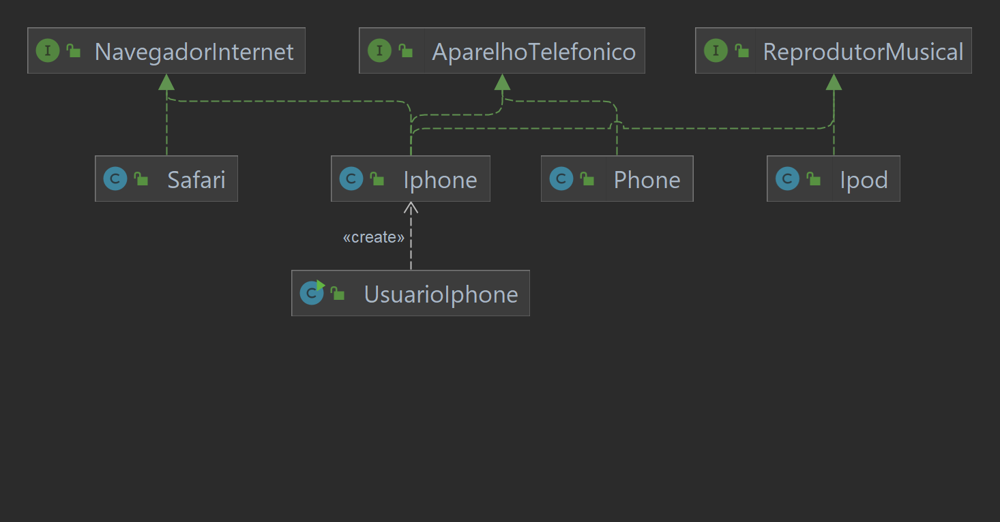

# Descrição do Desafio - Bootcamp Santander DIO 2.023

### Aluno: @thePaulCode
Concepção de análise de negócios, requisitos, conceitos da programação orientada a objetos e modelagem UML. Com base no vídeo de lançamento do iPhone conforme link abaixo, elabore em uma ferramenta de UML de sua preferência a diagramação das classes e interfaces com a proposta de representar os papéis do iPhone de: Reprodutor Musical, Aparelho Telefônico e Navegador na Internet. Em seguida, crie as classes e interfaces no formato de arquivos .java.

## Instruções

1. Assista ao vídeo de lançamento do iPhone para obter insights sobre suas funcionalidades e papéis: [Vídeo de Lançamento do iPhone](link_para_o_vídeo).

2. Utilize uma ferramenta de modelagem UML de sua preferência (como Lucidchart, Draw.io, Visual Paradigm, etc.) para criar um diagrama de classes que represente as classes e interfaces relacionadas aos papéis do iPhone: Reprodutor Musical, Aparelho Telefônico e Navegador na Internet.

3. No diagrama de classes, inclua as classes necessárias para representar as funcionalidades de cada papel do iPhone, bem como os relacionamentos entre essas classes.

4. Após concluir o diagrama de classes, gere as classes e interfaces em arquivos .java com base no diagrama. Certifique-se de seguir as boas práticas de programação orientada a objetos.

5. Organize os arquivos .java em uma estrutura de diretórios adequada.

6. Compartilhe o diagrama de classes UML e os arquivos .java criados em um repositório de controle de versão, como o GitHub.

7. Certifique-se de que o código Java gerado esteja bem comentado e siga convenções de nomenclatura apropriadas.

## Recursos

-  Ferramenta de modelagem UML: IntelliJ IDE Diagrams

## Entrega

A entrega deste desafio inclui:

- Diagrama de classes UML representando os papéis do iPhone.
- Arquivos .java que implementam as classes e interfaces definidas no diagrama.

## Resolução
Abaixo, Diagrama de classe UML elaborado:

## Observações

- Este desafio visa avaliar sua capacidade de modelar conceitos de programação orientada a objetos, criar diagramas de classes e implementar esses conceitos em código Java.

- Certifique-se de entender os papéis do iPhone (Reprodutor Musical, Aparelho Telefônico e Navegador na Internet) e representá-los de forma adequada no diagrama de classes.

- Caso tenha dúvidas, consulte o instrutor ou a comunidade de aprendizes para obter suporte.

- Este desafio é uma oportunidade de aplicar seus conhecimentos e praticar habilidades de análise, modelagem e desenvolvimento em Java.

Sinta-se livre para usar e alterar os arquivos desse Desafio. Boa sorte e divirta-se realizando este desafio!

